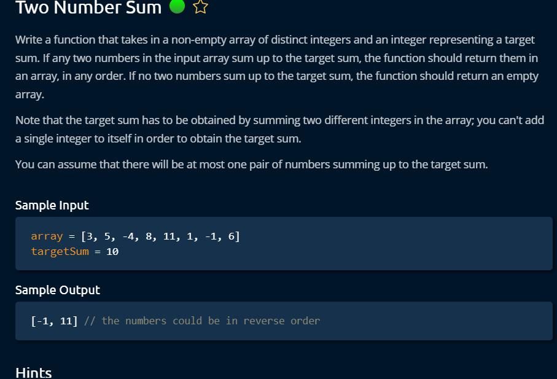

# ds-algo
Data structures and algorithms

# Hint 1
// time complexity o(N) and space complexity o(N)

Add the array elements in hashmap

x+y = targetSum;

y = targetSum -x;

iterate the given array and check if y is present in hashmap.

if it presents return x and y.

# Hint 2
// time complexity o(nlogn) (best array sorting)
// space complexity o(1)

sort the array

use two indexes one from beginning and one from last and compare two numbers
if sum is less than target increase lower index else higher index.

